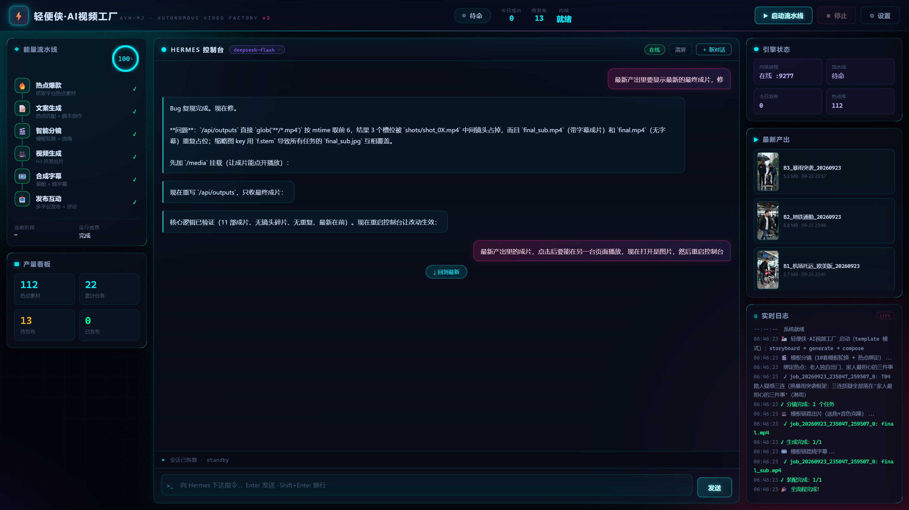

# ayh-mj — 轻便侠·AI视频工厂



电动轮椅软广视频全自动生产系统：**热点绑定 → 10套模板分镜 → 25演员智能选角 → H3音色克隆出片 → 烧字幕 → 9平台发布 → 评论互动**，全自动 12-16 秒抖音爆款成片。

## 双模式引擎

| 模式 | 链路 | 特点 |
|---|---|---|
| **template**（新，推荐） | 热点 → 10套模板轮换+热点台词注入 → 选角(@槽位轮换)+音色克隆出片 → 烧字幕 → 发布 | 人物/声音一致性、爆款结构、自动切换工作流 |
| legacy（兼容保留） | 脚本生成 → 分镜器 → batch_gen → TTS+合成 | 旧链路，无音色克隆 |

切换：`state/console.json` 的 `"mode": "template"`，或 `run_all.py --mode template`

## 快速开始

```bash
cd D:/@kaifa/ayh-mj && PY=.venv/Scripts/python.exe

# 全自动一条片（template 模式）
$PY tools/run_all.py                          # 全流程（读 console.json）
$PY tools/run_all.py --only storyboard,generate,compose   # 跳过热点的部分流程
$PY tools/run_all.py --dry                    # 演练（不出片）

# 控制台
webui/start_console.bat                       # → http://127.0.0.1:8899
```

> **控制台运维规则（重要）**
> - 控制台以 uvicorn `--reload` 运行：改完 `webui/` 下 Python 代码**保存即生效**（约 2 秒），**不需要重启**
> - 前端（static/templates）改完浏览器刷新即可
> - ⛔ 禁止用 `taskkill` / `Stop-Process` 杀 `server.py` 进程 —— 控制台是面板里 Hermes 自己的命令通道，杀它 = 自断回合（2026-09-24 两次实测事故）
> - 确实需要强制重启：`POST http://127.0.0.1:8899/api/restart`（脱离式安全重启）
> - `start_console.bat` 为守护模式：进程意外退出后 5 秒自动拉起；关掉该窗口才会真正停止


## 核心能力（2026-09-23 定型）

### 1. 一致性体系
- **人物**：`lib/cast.py` 角色卡司库 — 核心卡司 5（情绪图+音色）+ 演员库 25（城市20+欧美5）
- **声音**：`assets/cast/voice/` 29 角色音色样本 → zm_u08 `ref_audio_0` 克隆（同片一致）
- **选角槽位**：13 个 @槽位（@elder_male/@courier/@western_adult...）— 同片一致 + 跨片轮换（`state/casting_history.json`）

### 2. 模板工厂
- `assets/templates/` 10 套模板（T01母子换车 … T10雨夜接妈）
- `s3_storyboard/templates.py`：轮换（避开最近3套）+ 热点台词注入（角色铁律防错位）

### 3. 智能路由（`s4_generate/workflow_router.py`）
- 17 个 AutoDL 工作流自动选择 + 失败切换链
- 质量档：draft(480p ¥0.04/s) / standard(768p ¥0.06/s) / premium(1080p ¥0.10/s)
- 详见 `docs/workflow-matrix.md`

### 4. 出片与装配
- `s4_generate/gen_from_storyboard.py`：分镜 JSON → LLM 提示词 → 并发6路生成 → 拼接
- `s5_compose/burn_subtitles.py`：转写 → SRT（已知台词校正同音字）→ 烧录

## 目录结构

```
ayh-mj/
├── lib/                  # state(SQLite) / llm / tools / cast(卡司库) / keyfile(统一密钥)
├── s1_trend/             # 热点抓取（浏览器登录态）
├── s2_copy/              # 热点分析 / 脚本生成 / hot_patterns(爆款逻辑库)
├── s3_storyboard/        # split(legacy分镜) / templates(10套模板引擎)
├── s4_generate/          # autodl_client / workflow_router / gen_from_storyboard / ark_image
├── s5_compose/           # burn_subtitles(烧字幕) / merge(legacy) / tts / subtitle
├── s6_publish/           # publish(国内PostFlow+海外UploadPost) / engage
├── webui/                # FastAPI 控制台 8899
├── tools/                # run_all(执行入口) / 角色卡司生成 / 音色定妆 / archive(归档脚本)
├── assets/
│   ├── products/         # 产品白底图
│   ├── cast/             # 定妆图库(library25+emotions) + voice(29音色) + old_wheelchair
│   └── templates/        # 10套视频模板 YAML
├── docs/                 # workflow-matrix.md / shot-*.md 审核单
├── state/                # 运行状态（不进git）
└── out/                  # 成片输出（不进git）
```

## 凭据（统一 key 文件）

三平台 key 统一在 `D:/BaiduSyncdisk/2 @AI编程/Api Key/爱优护api.txt`（autodl/火山方舟/deepseek 中文标签段），`lib/keyfile.py` 解析，**该文件为权威源**。

## 成本参考

| 项 | 单价 |
|---|---|
| H3 出片 768p | ¥0.06/秒（4镜×3.5s ≈ ¥0.85/条） |
| 音色/角色图（Seedream） | 约 ¥0.3/张 |
| DeepSeek | 约 ¥0.01/条（提示词+台词） |
| **单条成片合计** | **约 ¥1.0** |

## License

MIT
