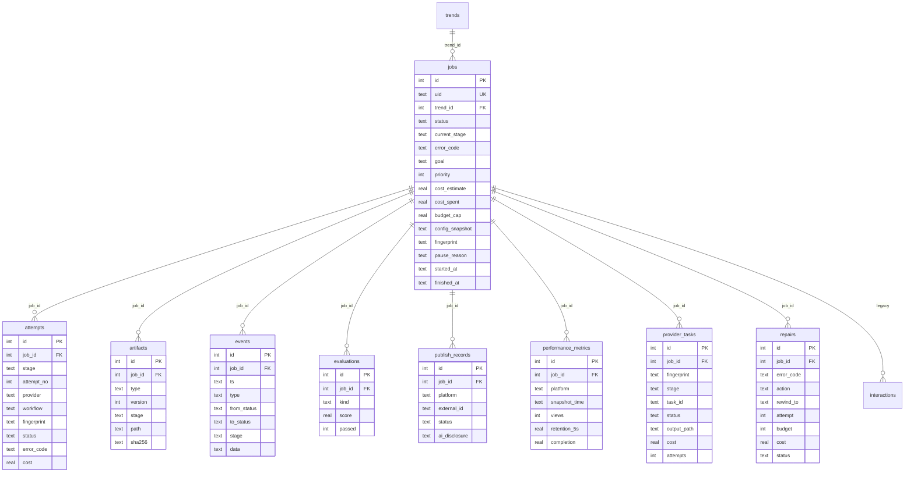

# ayh-mj vNext 架构

> 适用版本：Phase 0–15 重构后的主链（2026-09-30 起）。
> 改造前的"现在真正在跑什么"见 [`current_pipeline.md`](current_pipeline.md)（Phase 0 基线快照，只读历史）。

---

## 1. 目标与不变量

重构解决四个具体问题：**状态散落**、**入口多套**、**无法恢复/幂等**、**合规与发布不可审计**。
落到五条不变量，后续任何改动都不得破坏：

| # | 不变量 | 落地位置 |
|---|---|---|
| I1 | **JobStore 是唯一事实源**。状态、尝试、产物、事件、成本只写 `state/pipeline.db` | `lib/jobstore.py` |
| I2 | **Orchestrator 是唯一执行入口**。WebUI / CLI / Hermes 都调同一内核 | `lib/orchestrator/service.py` |
| I3 | **状态转换必须合法**。非法转换抛 `InvalidTransition`，绝不静默改库 | `lib/jobstore.py` `TRANSITIONS` |
| I4 | **付费动作幂等**。提交前落 fingerprint，重启后只 query 不重交 | `provider_tasks` + `lib/orchestrator/idempotency.py` |
| I5 | **对外文案必须过合规门**。出片前与发布前各一道 | `lib/claims.py` + `lib/packaging/gate.py` |

---

## 2. 分层

```text
┌──────────────────────────────────────────────────────────────┐
│ 入口层                                                       │
│   CLI   tools/orchestrate.py                                 │
│   WebUI webui/server.py (FastAPI, 127.0.0.1:8899)            │
│   Agent webui/hermes_bridge.py                               │
│   —— 三者都只调 PipelineOrchestrator，不自己写状态机          │
├──────────────────────────────────────────────────────────────┤
│ 编排层  lib/orchestrator/                                    │
│   service.py      执行内核：start / resume / retry / cancel  │
│   stages.py       六个 stage 的实现                          │
│   policies.py     每 stage 的重试/预算/门禁策略               │
│   idempotency.py  provider fingerprint 与 task 复用          │
│   providers.py    供应商适配（真实 / fake 可换）              │
│   recovery.py     崩溃恢复与 RepairEngine                    │
│   publishing.py   READY → 发布 → DONE/PAUSED/BLOCKED         │
├──────────────────────────────────────────────────────────────┤
│ 领域层                                                       │
│   creative/   CreativeDNA · StorySpec · Planner · Compiler   │
│               Router · Prescreen · Scorer · Director         │
│   qa/         验片 Critic（六维度 → error_code）              │
│   post/       AudioDirector · SFX · Loudness · transcript    │
│   packaging/  标题/描述/话题/首评/claim_ids/AI 声明           │
│   safety/     互动风控（熔断 · 频率 · 红线）                  │
│   claims.py   产品事实注册表（唯一来源）                      │
├──────────────────────────────────────────────────────────────┤
│ 事实层                                                       │
│   lib/jobstore.py    JobStore（状态机 + 事件 + artifact）     │
│   lib/migrations.py  版本化 schema（当前 v4）                │
│   lib/settings.py    config/default.yaml + AYHMJ_* 环境变量  │
│   state/pipeline.db  SQLite（WAL）                           │
└──────────────────────────────────────────────────────────────┘
```

---

## 3. 主链阶段

`STAGE_ORDER = (plan, preflight, generate, qa, compose, package)`（`lib/orchestrator/models.py`）。
每个 stage 是 `f(ctx) -> StageResult`，且**必须幂等**：产物已存在就跳过。

| # | stage | 推进到的状态 | 产物 / 副作用 | 主要失败码 |
|---|---|---|---|---|
| 1 | `plan` | `RESEARCHING` → `SCRIPTING` | Research artifact、CreativeDNA、StorySpec、编译后的 H3 prompt、路由与风险元数据、Claims 预检 | `PLAN_FAILED` `PROMPT_NOT_COMPILED` `CLAIM_*` |
| 2 | `preflight` | `PREFLIGHT` | 台词门禁（字数/句长/禁用符号）+ prompt 长度 | `PREFLIGHT_FAILED` `PROMPT_TOO_LONG` `PROMPT_BUDGET_EXCEEDED` |
| 3 | `generate` | `GENERATING` | H3 成片 mp4（`provider_tasks` 记 fingerprint/task_id） | `GENERATION_FAILED` `GENERATION_TIMEOUT` `PROVIDER_REJECTED` `NETWORK_TRANSIENT` `DOWNLOAD_FAILED` |
| 4 | `qa` | `QA`（必要时 `REPAIRING`） | 六维度 QA 报告 + 每维度 error_code | `ASR_MISMATCH` `SUBTITLE_ALIGN_FAIL` `PRODUCT_DEFORMED` `WRONG_SPEAKER` `HUMAN_ANATOMY_FAIL` `VISUAL_QA_FAIL` |
| 5 | `compose` | `COMPOSING` | 裁剪 / canonical transcript / 字幕 / BGM / 音效 / 归档 | `COMPOSE_FAILED` |
| 6 | `package` | `PACKAGING` → `READY` | Packaging artifact（标题/描述/话题/首评/claim_ids/AI 声明/目标平台） | `PACKAGE_FAILED` `PACKAGING_INCOMPLETE` |

`READY` 之后的发布是**另一个服务**（`PublishService`），不属于 stage：
`READY → PUBLISHING → LEARNING → DONE`，Gate 不过则 `BLOCKED`，部分平台失败则 `PAUSED`。

### 3.1 高风险构图先预筛

`plan` 会算构图风险（`lib/creative/prescreen.py`）。高风险或"中等风险 + 没用过的骨架"时，
先跑到一张 5 秒的预筛 spec（约 1/3 成本），PASS 才允许跑完整 15 秒正式片，
否则 `PRESCREEN_REQUIRED` / `PRESCREEN_FAILED`。**低风险任务不预筛**，不浪费预算。

### 3.2 workflow 路由与 fallback

`lib/creative/workflow.py` 按"必须保住的能力"（双音色对口型、多镜、15s 时长）挑工作流；
首选不可用/被拒时按兼容链 fallback（`SWITCH_WORKFLOW`）。**没有工作流能保住全部关键能力时拒绝提交**
（`WORKFLOW_INCOMPATIBLE`），而不是降级出一个残废的片子。

---

## 4. 数据库 ER

schema 由 `lib/migrations.py` 版本化管理，当前 **v4**（`SCHEMA_VERSION`）：

| 版本 | 名称 | 内容 |
|---|---|---|
| v1 | `legacy_baseline` | `trends` / `jobs` / `publishes` / `interactions` |
| v2 | `canonical_job_store` | `jobs` 扩展 + `attempts` / `artifacts` / `events` / `evaluations` / `publish_records` / `performance_metrics` |
| v3 | `provider_task_idempotency` | `provider_tasks`（`UNIQUE(job_id, fingerprint)`） |
| v4 | `qa_repair_records` | `repairs` |



**为什么这样分表**：状态与"为什么变成这个状态"分开存 —— `jobs` 只放当前快照（查询快），
`events` 放完整因果链（可审计），`attempts` 放每次尝试（可算重试成本），
`provider_tasks` 放"已经交过钱的那一次"（幂等的地基）。

`publishes` 表是 v1 遗留，Phase 10 起**不再写入**；发布事实只认 `publish_records`。

---

## 5. 状态机

canonical 状态定义在 `lib/jobstore.py`：`LINEAR`（13 个前进态）+ `SIDE`（4 个旁路态）。

```mermaid
stateDiagram-v2
    [*] --> PLANNING
    PLANNING --> RESEARCHING --> SCRIPTING --> PREFLIGHT --> GENERATING --> QA
    QA --> COMPOSING
    QA --> REPAIRING
    REPAIRING --> GENERATING
    REPAIRING --> COMPOSING
    COMPOSING --> PACKAGING --> READY
    READY --> PUBLISHING --> LEARNING --> DONE
    READY --> PAUSED
    state SIDE {
        PAUSED
        BLOCKED
        FAILED
        CANCELLED
    }
    PLANNING --> PAUSED
    PLANNING --> BLOCKED
    PLANNING --> FAILED
    PLANNING --> CANCELLED
    DONE --> [*]
    CANCELLED --> [*]
```

规则（`TRANSITIONS`）：

1. 沿 `LINEAR` 逐级前进；`QA` 允许跳过 `REPAIRING` 直接 `COMPOSING`。
2. `READY` 之前的任何前进态都可以交给 `REPAIRING`；`REPAIRING` 允许**回退**到更早的态重做
   （回退是合法转换，不需要 `force` 绕过状态机）。
3. 四个旁路态可恢复到任意"未终结"的前进态，也可继续 `CANCELLED`。
4. `DONE` 是终点，不再放行。
5. 旧写法（`pending` / `copy` / `storyboard` / `ready` / `published` 等）经
   `normalize_state()` 归一后再校验；迁移 v2 会把历史行一次性折算并写 `events`。

**正在跑**的定义 = `INTERRUPTIBLE_STATES`（`LINEAR` 去掉 `PLANNING` / `READY` / `DONE`）。
只有这些状态会被 `recover` 收敛为 `PAUSED`、被 `cancel` 终止。

---

## 6. 幂等与恢复

### 6.1 付费提交幂等

```text
generate stage
  ├─ fingerprint = hash(workflow + prompt + 输入资产 + 关键参数)
  ├─ provider_tasks 里已有该 (job_id, fingerprint)？
  │     有  → 只 query 原 task_id，绝不再 create_task
  │     没有 → create_task，先落 task_id 与 status=SUBMITTED，再轮询
  └─ 轮询成功 → 下载 → 记 output_path；下载失败只加 download 次数（不重新提交）
```

`tests/unit/test_idempotency.py` 用 fake provider 断言：同一 attempt 重跑
`create_task` 次数恒为 1；下载失败只涨 `download` 计数。

### 6.2 崩溃恢复

| 情况 | 行为 |
|---|---|
| 进程在 provider submit 后退出 | `provider_tasks` 已有 task_id → 重启后只 query |
| 进程在 stage 中途退出 | 任务留在"运行中"状态 → `orchestrate.py recover` 收敛为 `PAUSED` → `resume` 续跑 |
| 可重试的错误 | 按 `RETRYABLE_CODES` 同阶段重试；`TRANSIENT_CODES` 额外走指数退避（`backoff_delay`） |
| 业务错误 | `PERMANENT_CODES` 永不网络式无限重试 |
| 修复达上限 | `RepairEngine` 计数到 `budget` → `BLOCKED`，不无限循环 |

### 6.3 RepairEngine：error_code → 白名单动作

`REPAIR_MAP`（`lib/orchestrator/errors.py`）是唯一映射表，**表外一律 `ABORT`，绝不猜**：

| 动作 | 触发码（举例） | 语义 |
|---|---|---|
| `RETRY_SAME` | `NETWORK_TRANSIENT` `RATE_LIMIT` `DOWNLOAD_FAILED` `GENERATION_FAILED` | 同 workflow 同 prompt 再跑 |
| `SWITCH_WORKFLOW` | `GENERATION_TIMEOUT` `PROVIDER_REJECTED` | 换兼容 workflow 链 |
| `COMPRESS_PROMPT` | `PROMPT_TOO_LONG` `PROMPT_BUDGET_EXCEEDED` | 压缩后再提交 |
| `REGENERATE_SHOT` | `VISUAL_QA_FAIL` `PRODUCT_DEFORMED` `WRONG_SPEAKER` `HUMAN_ANATOMY_FAIL` | 重出成片 |
| `REBUILD_SUBTITLE` | `ASR_MISMATCH` `SUBTITLE_ALIGN_FAIL` | 只重建字幕，不重新生成 |
| `WAIT_AND_RESUME` | `PUBLISH_QUOTA` | 等窗口，`PAUSED` |
| `REQUIRE_HUMAN` | `COMPLIANCE_BLOCK` `AUTH_EXPIRED` `CLAIM_*` `CAPABILITY_BLOCKED` `BLOCKED_BUDGET` | `BLOCKED` + 人工提示 |
| `ABORT` | `UNKNOWN` 及表外 | `FAILED` |

一个 job 有多个 FAIL 时，`PRIMARY_PRIORITY` 决定用哪个码驱动修复 —— **合规类优先**，
避免先烧钱重生成一版、再因为文案违规被拦住。

---

## 7. 对外文案的两道门

```text
plan 阶段（出片前）                      package 之后（发布前）
  StorySpec 台词 + 画面字幕              标题 / 描述 / 话题 / 首评 / 封面文案
        │                                        │
        ▼                                        ▼
  lib.claims.gate(text, "script")        lib.packaging.gate.claims_check(text)
        │                                        │
        ├─ 未登记  → CLAIM_UNMAPPED             ├─ 同上四个码
        ├─ 待核验  → CLAIM_NEEDS_VERIFICATION   ├─ packaging artifact 完整性
        ├─ 红线    → CLAIM_FORBIDDEN            └─ AI 声明硬字段
        └─ 通过    → 继续                → 声明无法确认 → 草稿；无草稿通道 → REQUIRE_HUMAN
```

**为什么扫两次**：出片前扫的是"会烧钱的文案"，发布前扫的是"会公开出去的文案"。
只扫一次就会漏掉"出片后 LLM 又生成的标题/描述"这条路径。

声明硬门：`config/default.yaml` 的 `publish.ai_generated: true` +
`ai_disclosure_confirmable: {}`（默认所有平台都没确认）→ **只能传草稿**；没有草稿通道的平台转人工。
人工确认某平台可程序化提交声明后，把该平台设为 `true`。

---

## 8. 与旧管线的关系

Phase 14 收敛结果：

| 旧东西 | 现状 |
|---|---|
| `config/pipeline.yaml` | **已删除**；唯一权威配置是 `config/default.yaml` |
| `tools/run_all.py` | 保留但显式废弃（运行时打印 `[deprecated]`），逻辑覆盖在 `orchestrate.py` |
| 旧六阶段状态（`pending`/`copy`/`storyboard`/…） | 经 `STATUS_ALIASES` 归一为 canonical；v2 迁移一次性折算历史行 |
| 旧 `queue` 事实源（`state/queue_15s/*.json`） | 降级为 **spec 载体**，不再是状态源；状态只认 DB |
| 旧发布表 `publishes` | 只读历史；发布事实只认 `publish_records` |
| 第二套 BGM 选曲（`random.choice`）/ SFX 关键词插 | 已删；唯一入口 `lib.post.audio_director` / `lib.post.sfx` |
| 硬编码产品事实（LLM 默认文案、字幕高亮词） | 收敛到 `assets/products/claims.yaml` 与 `lib.settings` |
| `_deprecated_20260925/` | 归档；不参与 lint / pytest discovery / module import / WebUI |

回归证据：`tests/unit/test_legacy_fact_sources.py`。
